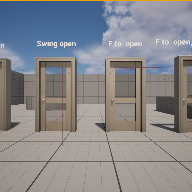

# Project Name  TheDoorsNotTheBand

## Descripton

A github repository for the in-class automatic opening door discussion. 

## Usage
Used as one of the weekly demonstrations, just a collection of examples as we explore UE5

Clone, or download the zip, to a local directory. Open in Unreal Engine 5.4 

Four versions of door blueprints are demonstrated.

### BP_DoorPopOpen 
Uses 2 static meshes and a large collision box around door to implement automatic door that pops open when player approaches. Uses the set relative rotation node. 

### BP_DoorSwingOpen 
Same as above but uses a TimeLine node and LERP to gradually swing door open close s layer approaches.

### BP_DoorInteractToOpen 
Similar t0 above but main collision box is used to enable input when player is near. A new InputAction we added to system, IA_Interact. With player in collision box, the input is enabled and the player can pass the F key to interact with the door, ie open or close it. Optinally, door closes when player leaves box. Note the addition of a second collision box nested under the door mesh. This second collision box is sized similar to the door and has its collision setting set to BlackAll in order to prevent the layer from walking through the closed door.

### BP_DoorInteractToOpenWithKey 
Same s above but the status of he player object's HasKey boolean is checked. If true, the player is allowed to interact with door.

